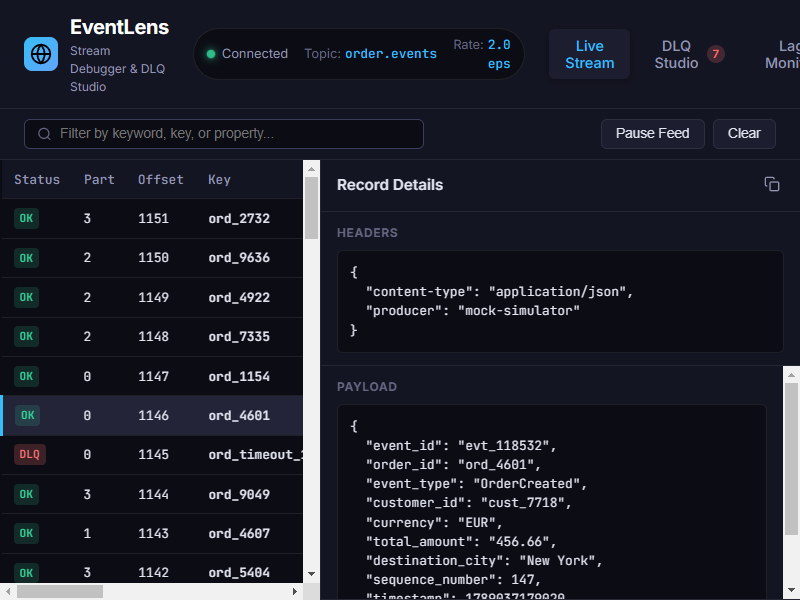
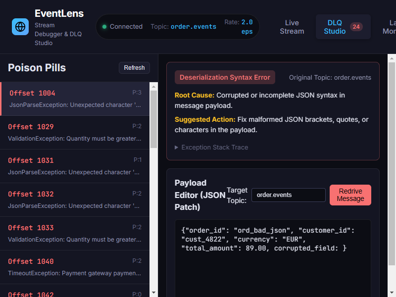
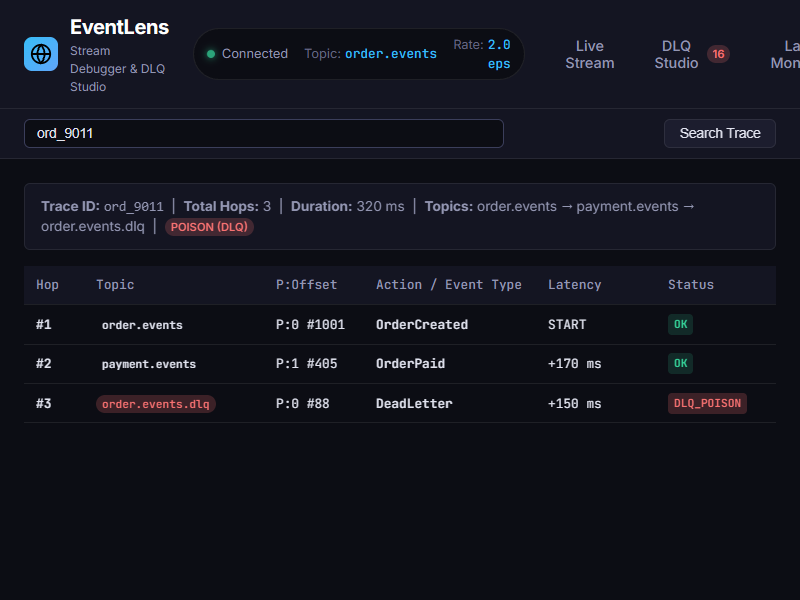
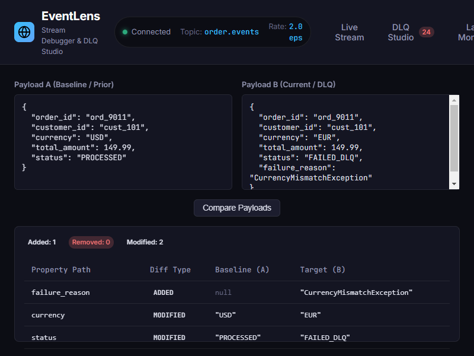
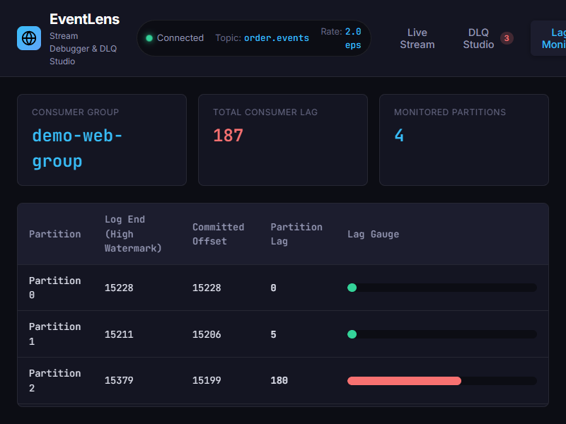

# EventLens

<p align="center">
  
  
  
  
  
</p>

<p align="center">
  Modern Developer-First Terminal & Web Kafka Event Stream Debugger and DLQ Studio.<br>
  Live Stream Tailing &bull; JMESPath Filtering &bull; Dynamic Protobuf/Avro &bull; Time-Travel Debugger &bull; DLQ Batch Redrive
</p>

<p align="center">
  
</p>

---

## Key Capabilities

- **Live Stream Tailing**: Terminal and web inspection with syntax highlighting and formatted record previews.
- **JMESPath & Regex Filtering**: Filter payloads on the fly across properties, headers, and keys.
- **Dynamic Schema Decoders**: Zero-compilation deserialization for JSON, Google Protocol Buffers (Proto3), and Confluent Avro wire frames.
- **Schema Registry Integration**: Confluent Schema Registry HTTP client with in-memory and disk caching.
- **Partition Lag Telemetry**: Real-time partition log-end watermarks and consumer group committed offsets.
- **Dead Letter Queue Studio**: Automated root cause diagnosis, stack trace parsing, and in-place payload patching with redrive dispatch.
- **Batch DLQ Redrive**: Bulk redrive failed records by category (e.g. `Outage`, `Syntax`, `Validation`) with dry-run preview.
- **Time-Travel Traffic Debugger**: Record Kafka streams into portable `.lens` session files and replay them with rate scaling.
- **Distributed Event Tracing**: Multi-topic correlation by correlation ID or entity key with latency delta calculation.
- **Structural Payload Diff Tool**: Side-by-side comparison of payloads or JSON files with added, removed, and modified highlighting.
- **Producer CLI & Web Modal**: Publish custom test events directly into Kafka topics.
- **Interactive Full-Screen TUI**: Keyboard-driven Textual interface with collapsible payload trees.
- **Local Web Studio**: Dark-theme WebSocket dashboard with sound alerts, trace graphs, diff comparison, and export (JSON, NDJSON, CSV).
- **Offline Simulation Mode**: Test all features (`eventlens demo`) without a live Kafka broker.

---

## Installation

Install via pip or uv:

```bash
pip install eventlens
# or with uv
uv tool install eventlens
```

To run from source:

```bash
git clone https://github.com/alexandrmotologa/eventlens.git
cd eventlens
uv sync --all-extras --dev
```

---

## Quick Start

### 1. Tail an active Kafka topic

Stream messages in real time:

```bash
eventlens tail order.events --broker localhost:9092
```

Tail from the beginning of the topic:

```bash
eventlens tail order.events --broker localhost:9092 --from-beginning
```

Filter payloads using JMESPath or regular expressions:

```bash
eventlens tail order.events --filter "total_amount > `100`"
eventlens tail order.events --regex "FAIL|ERROR"
```

### 2. Decode Protobuf and Avro payloads

Pass a `.proto` file to decode binary Proto3 payloads dynamically:

```bash
eventlens tail order.events --proto contracts/order_events.proto --message-type OrderEventEnvelopeProto
```

For Confluent Schema Registry integration:

```bash
eventlens tail order.events --schema-registry http://localhost:8081
```

---

### 3. Dead Letter Queue Triage & Batch Redrive

Inspect poisoned messages and automated failure diagnostics:

```bash
eventlens dlq inspect order.events.dlq --broker localhost:9092
```

<p align="center">
  
</p>

Batch redrive transient failures with dry-run verification:

```bash
# Dry run preview of transient outage failures
eventlens dlq redrive-batch order.events.dlq --category Outage --dry-run

# Live redrive up to 100 messages to the original topic
eventlens dlq redrive-batch order.events.dlq --category Outage --target order.events --limit 100
```

---

### 4. Distributed Event Tracing

Track an order or correlation ID across multiple topics to inspect routing and hop latencies:

```bash
eventlens trace ord_9011 --broker localhost:9092
# Or test with the built-in demo trace:
eventlens trace ord_9011 --demo
```

<p align="center">
  
</p>

---

### 5. Visual Payload Diff Tool

Compare two message payloads, JSON files, or topic offsets side-by-side:

```bash
eventlens diff '{"status": "PENDING", "amount": 100}' '{"status": "CONFIRMED", "amount": 100}'
# Demo comparison:
eventlens diff dummy dummy --demo
```

<p align="center">
  
</p>

---

### 6. Partition Lag Monitoring

Inspect consumer group offsets and partition lag against log-end watermarks:

```bash
eventlens lag order.events --group order-worker-group
```

<p align="center">
  
</p>

---

### 7. Time-Travel Debugger (Record & Replay)

Record live traffic into a `.lens` session file:

```bash
eventlens record order.events -o order_traffic.lens --max 500
```

Replay recorded traffic into a shadow topic at 2x speed:

```bash
eventlens replay order_traffic.lens --target shadow.orders --speed 2.0
```

---

### 8. Interactive Terminal UI (TUI)

Launch the full-screen terminal interface:

```bash
eventlens tui --topic order.events
# Offline demo:
eventlens tui --demo
```

Keyboard shortcuts in TUI:
- `Space`: Pause or resume stream ingestion.
- `/`: Focus search filter bar.
- `Tab`: Switch between views (Stream, DLQ Studio, Lag Monitor).
- `j` / `k`: Navigate record list.
- `c`: Copy selected payload JSON to clipboard.
- `Ctrl+R`: Open redrive confirmation modal on DLQ view.
- `q`: Quit application.

---

### 9. Local Web Studio

Launch the web studio on port 8080:

```bash
eventlens web --demo --port 8080
```

Open `http://localhost:8080` in your browser to access:
- Live streaming table with detail drawer inspector.
- DLQ Studio with failure diagnostics and JSON patch editor.
- Consumer lag gauges and watermark indicators.
- Distributed event tracing graph.
- Side-by-side payload diffing.
- Publish event modal.
- Poison pill audio alerts and export dropdown (JSON, NDJSON, CSV).

---

## Documentation

- [Architecture Overview](docs/architecture.md)
- [CLI Reference](docs/cli-reference.md)
- [Schema Decoders](docs/decoders.md)
- [Dead Letter Queue Studio](docs/dlq-studio.md)
- [Web Studio Guide](docs/web-studio.md)

---

## Development and Testing

Run test suite:

```bash
uv run pytest tests/unit -v
```

Run linter and formatter:

```bash
uv run ruff check .
uv run ruff format .
```

---

## License

This project is licensed under the MIT License. See [LICENSE](LICENSE) for details.
